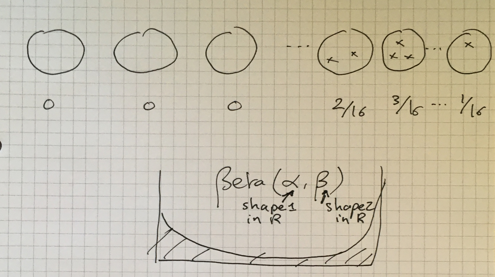
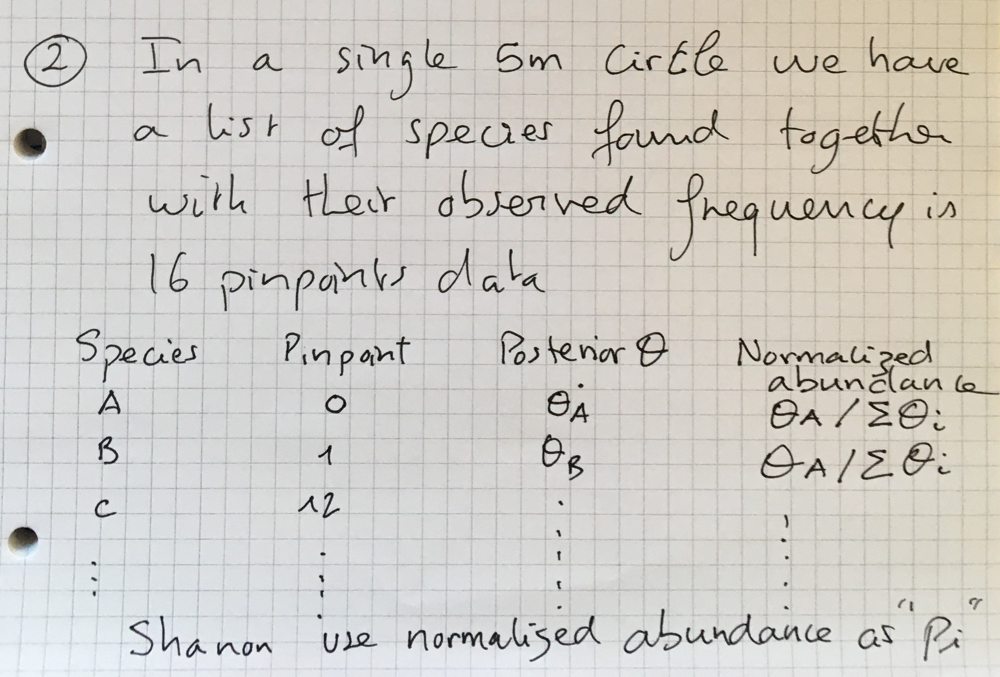

```{r setup, include=FALSE}
knitr::opts_chunk$set(echo = TRUE)
```

# The beta-binomial model in a nutshell:

To recap very very briefly and agree on parametrization, the three ingredients are :

The prior on $\theta$ the underlying proportion of the binomial distribution is Beta distributed 

More precisely, the prior distribution $f(\theta)$ on $\theta$:
$$
f(\theta) = \frac{\Gamma(\alpha + \beta)}{\Gamma(\alpha)\Gamma(\beta)}\theta^{\alpha - 1}(1-\theta)^{\beta - 1}
$$

The likelihood of the data ( $y$ "success" outcomes out of $n$ trials) under the binomial model is the probability of the data (here $Y= y$) given the model parameter(s) (here $\theta$):

$$
L(\theta|y) = Prob(data| \theta) =  Prob(Y= y| \theta) = {n \choose y} \theta^{y} (1-\theta)^{n-y}
$$


The posterior density $f(\theta|Y = y)$ is also Beta distributed ... In Bayesian jargon when prior and posterior distribution come from the same "family" we say that they *conjugate*. 

$$
\begin{split}
Y | \theta \ & \sim \text{Bin}(n, \theta) \\
\theta & \sim \text{Beta}(\alpha, \beta) \\
\end{split} \;\; \Rightarrow \;\; 
\theta | (Y = y) \sim \text{Beta}(\alpha + y, \beta + n - y) \; .
$$


# General setting for species X

Just a quick outline of the steps 

## Bayesian priors are empirically motivated from NOVANA

Species X is found in 25 out of 100 5m radius circles. 

That information is used to fit a Beta distribution that is then used as prior for all 5m circles in which we want to combine that info with pinpoint data for a Bayesian estimation of the local abundance of species X 
See the enclosed scan-overview sketch



## pinpoint data are combined with priors to get Bayesian mean posterior

Once the Bayesian posterior estimates of the frequency given priors and pointpoint data are available, normalized abundance (ie summing to 1) for the set of species are computed and these are the ingredients of Shannon diversity index (the $p_i log(p_i)$ )  .




# Code for method of moment beta density estimation

## Example 1 a clumped abundant species 
I first draw 100 underlying proportion (for the binomial) in `vec_ps` and then use these proportion to generate 100 relaization of pointpoint data (16 pinpoints)

```{r}
vec_ps <- rbeta(n = 100, shape1 = 0.8, shape2 = 0.2)
hist(vec_ps)
pseudo_data <- rbinom(n = 100, size = 16, prob = vec_ps)

hist(pseudo_data/16) # the actual observed frequencies

# note ML estimation in MASS::fitdistr() is numerically challenged when beta is v U shaped.
# beta_guess = list(shape1 = 0.5, shape2 = 0.5)
# MASS::fitdistr(x = pseudo_data/16, densfun = "beta", start = beta_guess)

# https://stats.stackexchange.com/questions/376634/how-to-pick-starting-parameters-for-massfitdist-with-the-beta-distribution

```

Method of moment 

## method of moment provides pretty robust estimates to start with  

```{r}
# install.packages("fitdistrplus")
library(fitdistrplus)

fitdist(data = pseudo_data/16, distr = "beta", method = "mme" )

mme_estimates <- fitdist(data = pseudo_data/16, distr = "beta", method = "mme" )

# Example 2 a clumped rare species 
vec_ps <- rbeta(n = 100, shape1 = 0.2, shape2 = 0.8)
hist(vec_ps)
pseudo_data <- rbinom(n = 100, size = 16, prob = vec_ps)

hist(pseudo_data/16) # the actual observed frequencies
mme_estimates <- fitdist(data = pseudo_data/16, distr = "beta", method = "mme" )

mme_estimates$estimate

```

## Quick simulation to get a feel for how estimates behave

I use a beta(0.2, 0.8) to generate the data, do a few simulated datasets to look at the distirbution of the MMe estimates 

```{r}
nsims <- 100 
beta1_vec <- rep(NA, nsims)
beta2_vec <- rep(NA, nsims)

for (i in 1:nsims){
  vec_ps <- rbeta(n = 100, shape1 = 0.2, shape2 = 0.8)
  pseudo_data <- rbinom(n = 100, size = 16, prob = vec_ps)
  mme_estimates <- fitdist(data = pseudo_data/16, distr = "beta", method = "mme" )
  beta1_vec[i] <- mme_estimates$estimate[1]
  beta2_vec[i] <- mme_estimates$estimate[2]
}
hist(beta1_vec)
hist(beta2_vec)

plot(beta1_vec, beta2_vec, col="grey20", cex=0.5, pch=20)
mean(beta1_vec)
mean(beta2_vec)
```

